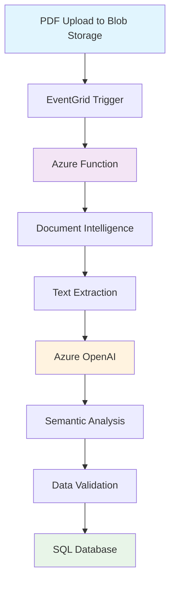

# Contract Processing Pipeline - Azure Function
[](https://azure.microsoft.com/)
[](https://www.python.org/)
[](https://azure.microsoft.com/en-us/products/functions/)

> **⚠️ IMPORTANT DISCLAIMER: This is a Development Accelerator - NOT Production Ready**

## 🚨 **Accelerator Notice**

**This solution is provided as a development accelerator and reference implementation only. It is NOT ready for production use.**

### ❌ **Missing Production Requirements:**
- **Unit Testing**: Comprehensive test coverage and test automation
- **AI Responsible Practices**: AI fairness, bias testing, and responsible AI implementation
- **Security Hardening**: Security scanning, vulnerability assessment, and penetration testing
- **DevOps Integration**: CI/CD pipelines, infrastructure as code, and deployment automation
- **LLMOps**: Model monitoring, performance tracking, and AI model lifecycle management
- **Compliance & Governance**: Data privacy, regulatory compliance, and audit trails
- **Performance Testing**: Load testing, stress testing, and performance optimization
- **Monitoring & Observability**: Application insights, telemetry, and alerting
- **Disaster Recovery**: Backup strategies, failover mechanisms, and business continuity

### ⚖️ **Microsoft Disclaimer**
Microsoft Corporation does not warrant, support, or assume any responsibility for this accelerator. This code is provided "AS IS" without warranty of any kind, either express or implied. Use of this accelerator is at your own risk. Microsoft shall not be liable for any damages arising from the use of this code.

---

## 🚀 Overview

This Azure Function implements a complete contract ingestion and processing pipeline that automatically processes PDF contracts uploaded to blob storage. The system leverages AI-powered extraction to transform unstructured contract documents into structured data for business intelligence and compliance monitoring.

### 🎯 Key Features

- **📄 PDF Processing**: Automatic text extraction using Azure Document Intelligence
- **🤖 AI-Powered Analysis**: Contract semantic analysis using Azure OpenAI
- **📊 Structured Data**: Converts contracts to standardized data models
- **🗄️ Database Integration**: Stores processed data in SQL Server with relational integrity
- **⚡ Real-time Processing**: EventGrid triggers for immediate processing
- **🔄 Idempotent Operations**: Safe retry mechanism to prevent duplicate processing
- **🛡️ Error Handling**: Comprehensive error handling and logging throughout the pipeline

## 🏗️ Architecture



## 🔄 Processing Pipeline

The system orchestrates a 5-stage processing pipeline:

1. **📥 Event Validation & Deduplication**
   - Validates EventGrid event structure
   - Prevents duplicate processing
   - Filters PDF files only

2. **📝 PDF Text Extraction**
   - Uses Azure Document Intelligence for OCR
   - Preserves document layout and structure
   - Handles multi-page documents

3. **🧠 AI-Powered Semantic Extraction**
   - Processes text through Azure OpenAI
   - Extracts contract entities (companies, dates, terms, penalties)
   - Returns standardized JSON with contract semantics

4. **✅ Data Validation & Model Creation**
   - Transforms AI output into validated Python dataclass models
   - Normalizes field names and validates data types
   - Ensures data integrity

5. **💾 Database Persistence**
   - Stores structured data in SQL Server
   - Maintains relational integrity across entities
   - Returns unique contract ID for tracking

## 📂 Project Structure

```
ContractsWalmartPOC/
├── contract_processor.py      # Main Azure Function (entry point)
├── contracts_agent.py         # AI extraction module
├── contract_models.py         # Data models and validation
├── contratosdb.py             # SQL database operations
├── datalake_services.py       # Blob storage operations
├── requirements.txt           # Python dependencies
├── host.json                  # Azure Function configuration
├── .env                       # Environment variables (not in repo)
└── sql/                       # Database schema scripts
    ├── create_tables.sql
    └── create_entity_tables.sql
```

## 🛠️ Core Components

### Contract Processor (`contract_processor.py`)
The main orchestrator that coordinates the entire processing pipeline. Handles EventGrid triggers and manages the workflow from PDF upload to database storage.

### AI Agent (`contracts_agent.py`)
Leverages Azure OpenAI to extract semantic information from contract text, transforming unstructured documents into structured JSON data.

### Data Models (`contract_models.py`)
Python dataclasses that define the contract data structure:
- `Contrato`: Main contract information
- `CompaniaInfo`: Client company details
- `ProveedoresInfo`: Provider information
- `Representantes`: Contract representatives
- `Multas`: Penalties and fines
- `Entidades`: Extracted entities

### Database Layer (`contratosdb.py`)
Handles SQL Server integration with proper transaction management and relational integrity.

### Storage Services (`datalake_services.py`)
Manages Azure Blob Storage operations including SAS URL generation and file operations.

## 🚀 Getting Started

### Prerequisites

- Python 3.11+
- Azure Function Core Tools
- Azure Storage Account
- Azure Document Intelligence Service
- Azure OpenAI Service
- SQL Server Database

### Environment Setup

1. **Clone the repository:**
```bash
git clone https://github.com/jorgelunams/contratospoc.git
cd contratospoc
```

2. **Install dependencies:**
```bash
pip install -r requirements.txt
```

3. **Configure environment variables:**
Create a `.env` file with the following variables:
```env
# Azure Storage
LAKE_KEY=your_storage_account_key

# Document Intelligence
DOCUMENT_INTELLIGENCE_ENDPOINT=https://your-di-service.cognitiveservices.azure.com/
DOCUMENT_INTELLIGENCE_KEY=your_document_intelligence_key

# Azure OpenAI
AZURE_ENDPOINT=https://your-openai-service.openai.azure.com/
AZURE_OPENAI_API_KEY=your_openai_key
AZURE_MODEL_NAME=your_model_deployment_name

# Database
SQL_CONNECTION_STRING=your_sql_connection_string
```

4. **Set up the database:**
```bash
# Run the SQL scripts to create required tables
sqlcmd -S your_server -d your_database -i sql/create_tables.sql
sqlcmd -S your_server -d your_database -i sql/create_entity_tables.sql
```

### 🏃‍♂️ Running Locally

```bash
# Start the Azure Function locally
func start

# Or run the debug script directly
python contract_processor.py
```

### 🚀 Deployment

Deploy to Azure using the Azure CLI:

```bash
# Create a Function App
az functionapp create \
  --resource-group your-rg \
  --consumption-plan-location eastus \
  --runtime python \
  --functions-version 4 \
  --name your-function-app \
  --storage-account your-storage

# Deploy the function
func azure functionapp publish your-function-app
```

## 📊 Data Flow

### Input: PDF Contract
The system processes PDF contracts containing:
- Contract terms and conditions
- Company information
- Representative details
- Penalty clauses
- Financial terms

### Output: Structured Data
Extracted and validated data including:
```json
{
  "Contrato": {
    "tipo_contrato": "Contrato de Servicios",
    "parte_cliente": "Walmart Chile",
    "monto_total": 500000,
    "fecha_inicio": "2024-01-01"
  },
  "CompaniaInfo": {
    "nombre": "Walmart Chile S.A.",
    "rut": "XX.XXX.XXX-X"
  },
  "Multas": [
    {
      "tipo_incumplimiento": "Incumplimiento de pago",
      "monto_multa_uf": 50
    }
  ]
}
```

## 🔧 Configuration

### Azure Function Settings
- **Runtime**: Python 3.11
- **Trigger**: EventGrid
- **Timeout**: 10 minutes
- **Memory**: 1.5 GB

### EventGrid Setup
Configure EventGrid to trigger on blob creation events:
```json
{
  "eventType": "Microsoft.Storage.BlobCreated",
  "subject": "/blobServices/default/containers/contracts",
  "includedEventTypes": ["Microsoft.Storage.BlobCreated"]
}
```

## 🔍 Monitoring & Logging

The system provides comprehensive logging at every stage:
- Event processing status
- PDF extraction progress
- AI analysis results
- Database operation outcomes
- Error details and stack traces

Monitor through Azure Application Insights for:
- Function execution metrics
- Error rates and patterns
- Performance insights
- Custom telemetry

## 🛡️ Error Handling

Robust error handling includes:
- **Retry Logic**: Automatic retry for transient failures
- **Graceful Degradation**: Partial processing when possible
- **Detailed Logging**: Complete error context for debugging
- **Status Reporting**: Clear success/failure status codes

## 🧪 Testing

Run the debug script to test the complete pipeline:
```bash
python contract_processor.py
```

This validates:
- Environment configuration
- Service connectivity
- Complete processing pipeline
- Error handling scenarios

## 🤝 Contributing

1. Fork the repository
2. Create a feature branch (`git checkout -b feature/improvement`)
3. Commit your changes (`git commit -am 'Add new feature'`)
4. Push to the branch (`git push origin feature/improvement`)
5. Create a Pull Request

## 📄 License

This project is licensed under the MIT License - see the [LICENSE](LICENSE) file for details.

## 🏢 Enterprise Integration

This solution is designed for enterprise-scale contract processing with:
- **Scalability**: Handles high-volume contract processing
- **Security**: Enterprise-grade security with Azure services
- **Compliance**: Audit trails and data governance
- **Integration**: REST APIs for downstream system integration

## 📞 Support

For support and questions:
- 📧 Email: [your-email@company.com]
- 📋 Issues: [GitHub Issues](https://github.com/jorgelunams/contratospoc/issues)
- 📖 Documentation: [Wiki](https://github.com/jorgelunams/contratospoc/wiki)

---

**Built with ❤️ for efficient contract processing automation**
